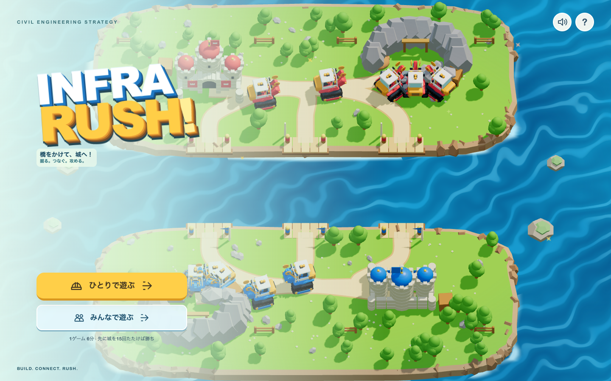
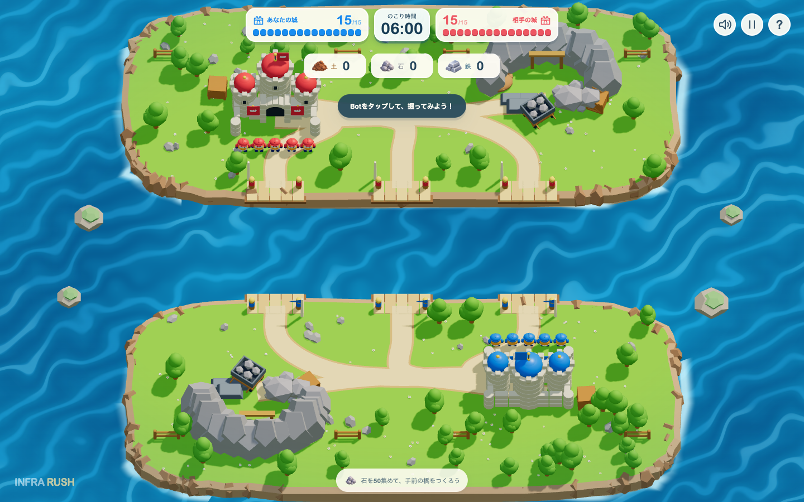
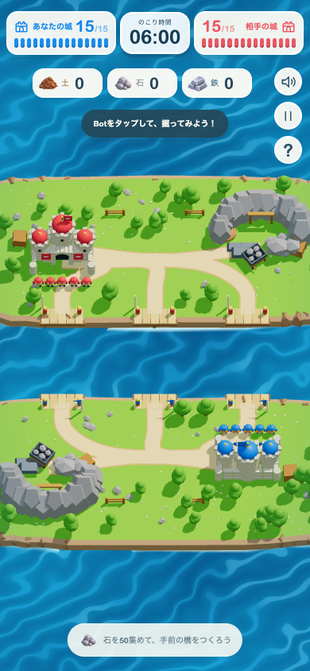

# INFRA RUSH

**掘る。つなぐ。攻める。** 5体の作業Botに指示を出し、資源を集めて橋を架け、相手の城へ道を通すブラウザ向け3D土木ストラテジーです。Bot同士は戦いません。採掘・施工・進軍に何体ずつ割り当てるかが勝負を決めます。

**[ブラウザで遊ぶ](https://numaters.github.io/infra-rush/)** · [ゲーム仕様書](INFRA_RUSH_SPEC.md) · [オンライン対戦の配置手順](docs/ONLINE_DEPLOYMENT.md)



## ゲーム画面

<p>
  
  
</p>

### 遊べるモード

- **チュートリアル:** 採掘、架橋、進軍、盛土、橋の破壊と整地を順番に練習できます。
- **CPU戦:** 「かんたん」「ふつう」「むずかしい」の3段階から選べます。
- CPU戦の結果画面では、感じた強さを任意で回答できます。匿名の回答と試合結果を今後のCPU調整に使います。
- **オンライン対戦:** ランダムマッチ、または数字5桁の招待コードで友人と対戦できます。切断後の再接続と、双方の同意による再戦に対応しています。

## ルールと操作

両チームは5体のBotとHP15の城を持ちます。6分以内に相手の城HPを0にすると勝利。時間切れでは残りHPが多いチームが勝ち、同数なら引き分けです。

1. 青いBotをタップして **「掘る」** を指示します。資源の土・石・鉄はチーム全体で共有します。
2. 石を50集めたら **「橋をつくる」** で自陣の橋を架けます。中央の橋は両チームが取り合う共有地点です。
3. 通れる橋ができたら **「攻める」**。Botは橋を渡って相手の城を攻撃し、自陣へ戻ります。
4. 鉄で橋を補強・修繕・破壊し、土で相手の道を塞ぎます。自軍の道が塞がれたら整地して復旧します。地震による橋の損傷にも備えてください。

Botや搭乗中の重機はマップ上で選択できます。PCでは数字キー **1〜5** でも自軍Botを選べます。左ドラッグ・1本指で視点移動、ホイール・ピンチで拡大縮小、右ドラッグ・2本指で回転します。作業の費用と時間、橋の条件は[ゲーム仕様書](INFRA_RUSH_SPEC.md)にまとめています。

## ローカルで起動する

必要なもの: **Node.js 22.12以上**、npm。オンライン対戦をローカルで動かす場合は **Go 1.25以上** も必要です。

### ひとりで遊ぶ

```sh
git clone https://github.com/NUMaters/infra-rush.git
cd infra-rush
npm ci
npm run dev
```

ターミナルに表示されるURL（通常 `http://localhost:5173/`）を開き、「ひとりで遊ぶ」からチュートリアルまたはCPU戦を選びます。スマートフォンでも、開発用PCと同じLANのIPアドレスと表示されたポートでアクセスできます。

### 2人でオンライン対戦する

プロジェクトのルートでビルドし、Goサーバーから画面とWebSocketを配信します。

```sh
npm ci
npm run build
go run ./server -addr :8080 -static dist -master master
```

2つのブラウザで `http://localhost:8080/` を開き、「みんなで遊ぶ」を選びます。ランダム対戦なら双方が待機、招待対戦なら一方が部屋を作り、もう一方が表示された5桁のコードで参加します。両者が準備完了にすると試合が始まります。

公開版はGitHub Pagesが画面を、Goサーバーがリアルタイム対戦を担当します。自分の環境へ配置する場合のHTTPS/WSSと接続先設定は[オンライン対戦の配置手順](docs/ONLINE_DEPLOYMENT.md)を参照してください。

## 技術スタック

- **フロントエンド:** TypeScript、Vite、Three.js。ゲーム画面、3Dマップ、Bot・重機のアニメーション、操作UIをブラウザで描画します。
- **1人用ゲームロジック:** TypeScript。CPUの判断と資源・橋・勝敗をクライアント側で処理します。
- **オンラインサーバー:** Go、`gorilla/websocket`。試合状態をサーバーで管理し、WebSocketで指示と状態をやり取りします。
- **3Dアセット:** Blenderで制作し、GLB/glTFとして書き出してThree.jsへ読み込みます。
- **検証・配布:** Vitest、Playwright、Goのテスト、GitHub Actions / GitHub Pages、Fly.io。PWA用のマニフェストとサービスワーカーも含みます。

オンライン対戦では、ブラウザがBotへの指示を送り、Goサーバーが50ms間隔で試合を進めます。資源の消費、Botの作業、橋や城の状態、勝敗はサーバー側で判定します。部屋はサーバーのメモリ内で管理するため、サーバー再起動後に進行中の試合は復元されません。

## プロジェクト構成

- `src/game/` — ゲームルール、Botの指示、CPU
- `src/render/` — Three.jsによるマップ・モデル・演出
- `src/net/` — オンライン対戦のWebSocketクライアント
- `src/ui/` — 画面用のアイコンなど
- `server/` — Goの対戦サーバーとゲームルール
- `master/` — 資源、費用、橋、城、CPUなどの調整値
- `assets/blender/` — 編集用Blenderファイルとモデル生成スクリプト
- `public/models/` — ブラウザで使用するGLBモデル
- `docs/` — 設計記録、配置手順、画面画像

## 開発コマンド

```sh
npm run dev           # Vite 開発サーバー
npm run build         # TypeScript 確認と配布用ビルド
npm run preview       # ビルド結果をローカル表示
npm run lint          # ESLint
npm run format:check  # Prettier
npm test              # ゲームロジックのテスト
go test ./server      # Go サーバーのテスト
npm run test:e2e      # Playwright のブラウザテスト
```

E2E実行時は先に開発サーバーを起動し、Playwrightのブラウザが未導入なら `npx playwright install chromium` を実行してください。モデルを作り直す場合、macOSの標準的なBlender配置では `npm run assets` を使用できます。それ以外の環境では `blender --background --python assets/blender/build.py` を実行してください。元データは `assets/blender/infra-rush.blend` にあります。

詳細なルールは[ゲーム仕様書](INFRA_RUSH_SPEC.md)、公開環境の設定は[オンライン対戦の配置手順](docs/ONLINE_DEPLOYMENT.md)を参照してください。
