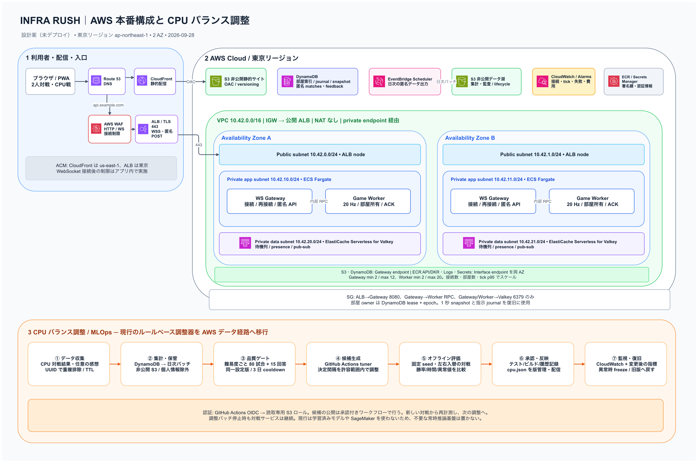

# INFRA RUSH AWS 配置アーキテクチャ設計

設計日: 2026-09-28 / リージョン: ap-northeast-1（東京） / 状態: **設計案・未デプロイ** / 実装の棚卸し: [CURRENT_TECHNOLOGY.md](CURRENT_TECHNOLOGY.md)

編集可能な draw.io 原本: [AWS_ARCHITECTURE.drawio](AWS_ARCHITECTURE.drawio)。[SVG](AWS_ARCHITECTURE.svg) と PNG は draw.io からの書き出し。図のサービスアイコンは [AWS Architecture Icons の 2026-07-31 版](https://aws.amazon.com/architecture/icons/)を埋め込んだ。CIDR、タスク数、閾値、SLO はこのプロジェクト向けの**提案値**であり、AWS が自動設定する値ではない。

再編集時は `.drawio` を diagrams.net で開く。原本の生成は `python3 docs/architecture/generate_aws_drawio.py`、図の変更後の PNG / SVG 書き出しは draw.io の「ファイル → 形式を指定してエクスポート」を使う。画像は全体を拡大して、文字、アイコン、矢印の重なりを確認する。

## 1. 結論と設計の境界

現在の 1 プロセス Go サーバーは、部屋・ランダム待機列・接続トークン・試合状態をメモリに保持し、匿名データはローカル JSONL に書く。このまま複数タスク化しても対戦者が同じ部屋に入れる保証はない。従って、以下の二段階で移行する。

| 段階 | 内容 | 可用性と拡張性 |
| --- | --- | --- |
| A: 小規模移行 | 静的配信を S3 + CloudFront、Go を ECS Fargate **1 タスク** + ALB、JSONL を EFS Access Point に保存。東京 1 AZ にタスクを置く | AWS 上で現行機能を再現できるが、試合の単一障害点は残る。ECS を 2 台に増やさない |
| B: 推奨本番 | WS ゲートウェイと部屋所有ワーカーを分離。DynamoDB に部屋索引・指示ジャーナル・スナップショット・匿名データ、ElastiCache Serverless for Valkey に待機列と配信を置く。2 AZ の ECS サービスを個別にスケール | ゲートウェイ障害とワーカー障害から再接続・復元できる。**図はこの段階** |

現行 Fly.io / GitHub Pages は AWS 移行が完了するまで変更しない。本書は AWS リソースの作成、費用発生、公開先の切替を実行した記録ではない。

## 2. 参照した類似サービスと採用判断

| 公開事例 | 確認した設計原則 | INFRA RUSH への反映 |
| --- | --- | --- |
| [Nakama の権威的マッチ](https://heroiclabs.com/docs/nakama/concepts/multiplayer/) / [アーキテクチャ](https://heroiclabs.com/docs/nakama/getting-started/architecture/) | サーバーがゲーム規則を判定し、マッチングとリアルタイム接続を管理。複数ノード間の配信と部屋ライフサイクルを明示 | Go の権威的ルールを維持。ルーティング・所有権・切断復帰を別の設計課題として扱う |
| [Colyseus のスケーリング](https://docs.colyseus.io/scalability) / [Presence](https://docs.colyseus.io/server/presence) | 1 部屋は 1 プロセスに属し、複数プロセスの探索・通信には共有 Presence/Driver を使う | 1 試合に 1 所有ワーカーを割り当て、共有待機列と部屋索引を導入する。ALB の粘着設定だけに依存しない |
| [Amazon GameLift Servers の WebSocket ベース構成](https://docs.aws.amazon.com/gameliftservers/latest/developerguide/gamelift_quickstart_customservers_designbackend_arch_websockets.html) / [容量バッファ](https://docs.aws.amazon.com/gameliftservers/latest/developerguide/fleets-autoscaling-target.html) | 接続受付・マッチ配置・ゲームセッションの容量を分離し、待ち時間と空き容量をトレードオフで管理 | 6 分程度の 2 人対戦と既存 Go/WS を活かすため、当面は ECS に自前ワーカーを配置。将来、セッション管理の運用負担が増えたら GameLift を再評価 |

**推論:** 類似サービスの構成は選択肢を示すもので、このゲームの 20 Hz・状態サイズ・接続数で同じ性能が出る証拠ではない。負荷試験で容量を決める。

## 3. ターゲット構成と通信経路

### エッジと静的配信

1. Route 53 の <code>game.example.com</code> を CloudFront に、<code>api.example.com</code> を internet-facing ALB に割り当てる。実ドメイン未決定のため名前は例。CloudFront 用 ACM 証明書は us-east-1、ALB 用は ap-northeast-1 に置く。
2. CloudFront の S3 **REST オリジン**に OAC を設定し、S3 は Block Public Access を有効化。<code>index.html</code> と <code>sw.js</code> は短いキャッシュ、内容ハッシュ付き JS/CSS/GLB は長いキャッシュ。SPA の直リンクをアプリへ戻すルールを設定する。S3 website endpoint と OAC を組み合わせない。[AWS の OAC 手順](https://docs.aws.amazon.com/AmazonCloudFront/latest/DeveloperGuide/private-content-restricting-access-to-s3.html)。
3. 静的ビルドの <code>BASE_URL</code> を AWS のルート配信に合わせ、<code>VITE_ONLINE_WS_URL=wss://api.example.com/ws</code> を埋め込む。リリース時には GLB/音声/サービスワーカーの URL を実ブラウザで確認する。
4. ALB は TLS 443 を終端し、<code>/ws</code> と匿名データ POST をゲートウェイへ転送。ALB は WebSocket をネイティブサポートする。[AWS ALB リスナー](https://docs.aws.amazon.com/elasticloadbalancing/latest/application/load-balancer-listeners.html)。Regional WAF はハンドシェイクと HTTP API を制限するが、WebSocket 接続後のメッセージ量はアプリ側で制限する。

### VPC・サブネット・経路

| 項目 | 提案値 |
| --- | --- |
| VPC | <code>10.42.0.0/16</code>、東京 2 AZ。AZ ID はアカウント間で一致するものを IaC で選択 |
| Public A/B | <code>10.42.0.0/24</code> / <code>10.42.1.0/24</code>。ALB、ルート <code>0.0.0.0/0 → IGW</code> |
| Private app A/B | <code>10.42.10.0/24</code> / <code>10.42.11.0/24</code>。ECS Gateway と Worker、<code>assignPublicIp=DISABLED</code> |
| Private data A/B | <code>10.42.20.0/24</code> / <code>10.42.21.0/24</code>。Valkey 接続用サブネットグループ。インターネット既定経路なし |
| Private routing | NAT は初期構成に置かない。S3・DynamoDB は Gateway VPC Endpoint、ECR API / ECR DKR / CloudWatch Logs / Secrets Manager は Interface VPC Endpoint を各 AZ に配置し Private DNS を有効化。外部 API が必要になった時だけ NAT かプロキシを再検討 |
| Security groups | ALB: 443 をインターネットから受信。Gateway: 8080 は ALB SG のみ。Worker: 内部 RPC ポートは Gateway SG のみ。Valkey: 6379 は Gateway/Worker SG のみ。Endpoint: 443 は app SG のみ。送信も宛先 SG/endpoint へ絞る |

ECR のプライベート pull では <code>ecr.api</code> / <code>ecr.dkr</code> と S3 Gateway Endpoint、<code>awslogs</code> には Logs Endpoint が必要。[ECR VPC Endpoint](https://docs.aws.amazon.com/AmazonECR/latest/userguide/vpc-endpoints.html)。Interface Endpoint は時間・転送量課金があるため、NAT 2 台との比較を四半期ごとに行う。共有 VPC や外部依存を追加した場合は経路を再監査する。

### 試合・匿名データ

1. **WS Gateway (ECS Fargate):** ALB の WSS を受け、トークン認証、待機・部屋参加、接続の在席を処理する。匿名ゲストトークンは署名・期限付きに改め、現在の 32 文字トークンのメモリ依存を外す。<code>Origin</code> の許可リストを AWS 配信先へ更新し、Origin 不在時の扱いも用途別に固定する。
2. **部屋索引 (DynamoDB):** 5 桁招待コードから内部 UUID の部屋へ写像し、条件付き書き込みで衝突なく確保。<code>roomId → ownerWorkerId, ownerEpoch, leaseUntil, status</code> を持つ。5 桁は推測可能なので参加試行を制限し、期限切れ判定はアプリで行う。DynamoDB TTL の物理削除は即時ではない。[TTL の仕様](https://docs.aws.amazon.com/amazondynamodb/latest/developerguide/TTL.html)。
3. **Game Worker (ECS Fargate):** 1 部屋を 1 ワーカーだけが所有し、Go の権威的ルールを 20 Hz で実行。Gateway は部屋索引から所有者の private address を取得して内部 RPC で指示を送る。所有権は lease と単調増加 epoch でフェンスし、二重 tick を禁止する。ワーカーの登録と private address の更新は起動/終了フックで管理する。
4. **耐久性:** Gateway は指示をワーカーへ渡し、ワーカーは <code>(roomId, playerId, seq)</code> を条件付きでジャーナルへ永続化してから ACK。ワーカーは約 1 秒ごとに試合スナップショットと RNG 状態・tick 番号を保存。障害時は新所有者が最後の snapshot と journal を再生し、両クライアントが再接続する。ACK 済み指示を失わないための設計で、実際の RPO は再生テストで確認する。
5. **Valkey:** ランダム待機列、短期 presence、状態配信用 pub/sub に使用。配信は揮発性でよく、唯一の正本にしない。Gateway が購読する部屋チャンネルへ Worker が状態を publish。ElastiCache Serverless for Valkey は Multi-AZ 複製を提供する。[AWS の説明](https://docs.aws.amazon.com/AmazonElastiCache/latest/dg/disaster-recovery-resiliency.html)。
6. **匿名結果と回答:** <code>/matches</code>・<code>/feedback</code> を Gateway が検証し、UUID 条件付き put で DynamoDB に保存。個人名・招待コード・IP を分析データへ入れず、TTL を 60～90 日に設定。日次 EventBridge Scheduler → バッチで非公開 S3 に集計用エクスポート。現行の GitHub Actions チューナーは OIDC で S3 の限定オブジェクトだけ読み、境界付き変更・テスト・公開という挙動を維持する。公開用の長期 bearer token と <code>/balance/export</code> は移行後に廃止する。

### CPU バランス調整の MLOps

**現状:** [CPU MLOps の決定記録](../decisions/023-cpu-mlops.md)と[運用手順](../balance/README.md)にある仕組みは、学習済みモデルを提供する推論サーバーではない。CPU の行動規則は固定し、難易度ごとの**判断間隔だけ**を匿名対戦結果と任意アンケートで小幅に調整する。現在は Fly.io の非公開 JSONL と token 保護された export API を GitHub Actions が日次で読み、評価・テスト後に `master/cpu.json` と `docs/balance/history.jsonl` をコミットして Pages を更新する。

**AWS 移行後の提案経路:**

1. Gateway は CPU 戦の UUID、難易度、CPU 設定版、勝敗、時間、任意回答を検証し、DynamoDB に条件付き保存する。名前、招待コード、IP、接続トークンは分析レコードに入れない。TTL と S3 lifecycle で保存期間を限定する。クライアント自己申告と回答者バイアスは品質上の限界として維持する。
2. EventBridge Scheduler が日次バッチを起動し、現行設定版だけの集計を S3 の非公開・版管理済み prefix に出す。失敗時は再試行と失敗通知を設定し、前回の正常な集計を上書きしない。バッチはオンライン対戦の必須経路から外す。
3. GitHub Actions は AWS OIDC の短期認証で**集計用 prefix の読み取りだけ**を許可する。リポジトリとブランチを IAM trust policy の `sub` で制限し、S3 の生データや他のゲーム状態への権限を与えない。[AWS IAM の OIDC 手順](https://docs.aws.amazon.com/IAM/latest/UserGuide/id_roles_create_for-idp_oidc.html)。
4. チューナーは難易度ごとに現行設定版の試合 **80 件以上**、回答 **15 件以上**、前回更新から **3 日以上**を確認し、勝率と体感が矛盾しない場合にだけ、`master/cpu-balance-policy.json` の境界・最大歩幅内で候補を作る。固定 seed の左右入替 CPU 戦、`npm test`、`npm run build`、ESLint を通す。データ不足、逆効果、異常値、ジョブ失敗では設定を変えない。
5. 変更候補と集計要約は Git 履歴で版管理する。本番移行時には候補 PR と承認ゲートを追加し、静的サイトの S3 prefix → CloudFront へ配布する。現行の Actions は自動で `main` にコミットするため、**承認ゲートは未実装の追加要件**である。公開後は設定版ごとに勝率、回答傾向、対戦完了率、ジョブ失敗、費用を監視し、新しい設定版のデータが揃うまで次の調整をしない。
6. 異常時は policy の `enabled=false` または難易度別 `frozen=true` で停止し、`cpu.json` を前の版に戻して配布する。旧版への復帰と次回自動昇格の抑止を同時に行う。バッチ停止・データ不足があっても対戦 API は継続する。

これらは GitHub Actions と S3 の短時間バッチで足りる規模を想定した構成で、SageMaker の常時エンドポイントは置かない。行動方策を実際に学習する段階に進む場合は、データ契約、学習・評価の再現性、モデル登録、段階配信、推論遅延と費用を別途設計する。

## 4. 可用性・スケーリング・容量

| 項目 | 初期値と判断条件 |
| --- | --- |
| Gateway | ECS Fargate min 2（各 AZ 1）、max 12。CPU 60%、メモリ 70%、カスタム「アクティブ WS 接続/タスク」目標を併用。接続目標は負荷試験で決定。ALB request 数だけでは長時間接続の負荷を表せない。[ECS スケーリング](https://docs.aws.amazon.com/AmazonECS/latest/developerguide/capacity-autoscaling-best-practice.html) |
| Worker | min 2（各 AZ 1）、max 20。CPU 60% に加え「アクティブ部屋数/タスク」と tick 処理 p95 を監視。仮の 100 部屋/タスクは**未検証の試験開始値**。スケールイン時は新規割当停止→既存試合終了/所有権移管→停止 |
| ALB | 2 AZ、<code>/health</code> を HTTP ヘルスチェック、idle timeout 120 秒。Go サーバーは 15 秒 ping を維持。ターゲットの deregistration delay は少なくとも 360～420 秒を候補にし、6 分試合と再接続 UX を実測して決定。ALB の標準値は idle 60 秒・drain 300 秒。[idle](https://docs.aws.amazon.com/elasticloadbalancing/latest/application/application-load-balancers.html)、[drain](https://docs.aws.amazon.com/elasticloadbalancing/latest/application/edit-target-group-attributes.html) |
| 故障時の目標 | 設計目標: 月間オンライン可用性 99.9%、単一タスク/AZ 故障の復帰 RTO 60 秒以内、ACK 済み指示の RPO 0。**達成済み SLO ではない**。新規接続と進行中試合の可用性を分けて測る |
| 負荷試験 | 100 / 500 / 2,000 同時 WS、各接続の状態更新 20 Hz、CPU・tick 遅延・送信キュー・ALB LCU・Valkey ECPU・DynamoDB throttling を測定。帯域目安は <code>同時接続数 × 20 × 状態メッセージ平均 bytes</code>。全量状態配信が律速なら差分配信・圧縮を検討 |

ALB が WebSocket 接続をターゲットに固定しても、その接続先と**試合所有者**は別概念。既存の in-memory Hub を各 Gateway に複製する設計は採用しない。また DynamoDB に 20 Hz の全状態を書かず、1 秒 snapshot + 指示ジャーナルとする。タスク減少で進行中ゲームを殺さないことをスケーリングの必須条件にする。

## 5. セキュリティ、デプロイ、運用

- **境界:** S3 を非公開・OAC、ALB は HTTPS のみ、Gateway/Worker は private subnet、Valkey は data subnet。WAF は一般的な制限と招待コード・匿名 POST のレート制限。WS メッセージのサイズ・種類・指示頻度は Go で検査し続ける。
- **権限:** ECS task role と execution role を分離。Gateway は部屋索引/匿名データ、Worker は部屋索引/ジャーナル/スナップショット、日次バッチはエクスポート先 S3 だけ。Secrets Manager に署名鍵・Valkey 認証情報を置き、自動ローテーション方針を定義。GitHub Actions から AWS は OIDC 短期認証で、長期アクセスキーを置かない。
- **配布:** GitHub Actions で lint・TypeScript/Go テスト・ビルド・アセット URL 確認→ECR に digest 固定 push→ステージングで 2 ブラウザ対戦→ECS rolling deploy。ECS deployment circuit breaker と CloudWatch alarm rollback を有効化。[AWS rollback](https://docs.aws.amazon.com/AmazonECS/latest/developerguide/deployment-circuit-breaker.html)。静的ファイルは版管理した S3 prefix に配置し、HTML とサービスワーカーは最後に切替。Go サーバー/クライアントのプロトコル互換期間を最低 1 リリース設ける。
- **観測:** CloudWatch に <code>ws_connections</code>、<code>queue_wait_p95</code>、<code>active_rooms</code>、<code>tick_duration_p95</code>、<code>state_bytes_per_sec</code>、<code>reconnect_success</code>、<code>worker_recovery</code>、HTTP 4xx/5xx を送る。ログは room UUID と相関 ID を使い、トークン・名前・回答本文は出さない。ALB target healthy が 2 未満、5xx 増加、DynamoDB throttle、Valkey 障害、CPU チューナー失敗で通知。
- **復旧:** DynamoDB PITR、S3 versioning とライフサイクル、ECR immutable tag/scan、CloudFront/ALB 設定の IaC 化。四半期ごとに 1 AZ 停止・Worker 強制終了・誤設定 rollback・snapshot 再生を演習する。EventBridge/バッチを停止してもオンライン対戦は続けられるよう依存を分離する。

## 6. コストモデル（東京、税・無料枠・転送料を除く概算）

2026-09-28 に公開 AWS Price List の東京リージョン SKU を参照した**設計用の仮計算**。730 時間/月、Linux x86、Gateway 2 × (0.25 vCPU, 0.5 GiB)、Worker 2 × (0.5 vCPU, 1 GiB)、ALB 1 LCU、Interface Endpoint 4 種類 × 2 AZ、Valkey 最低 0.1 GB を仮定する。タスクサイズ・接続容量・リージョン単価を契約前に [AWS Pricing Calculator](https://calculator.aws/) で再見積もりする。

| 項目 | 計算 | 月額概算 USD |
| --- | --- | ---: |
| ECS Fargate 4 タスク | 730 × {2 × (0.25 × 0.05056 + 0.5 × 0.00553) + 2 × (0.5 × 0.05056 + 1 × 0.00553)} | 67.47 |
| ALB 基本 + 1 LCU | 730 × (0.0243 + 0.008) | 23.58 |
| Interface VPC Endpoint 8 個 | 730 × 8 × 0.014 | 81.76 |
| Valkey Serverless 最低データ量 | 730 × 0.1 GB × 0.101 | 7.37 |
| **上記のみの固定的な下限** | 変動費と他サービスを除外 | **180.18** |

単価の出典: [Fargate 料金](https://aws.amazon.com/fargate/pricing/)と[東京 ECS Price List](https://pricing.us-east-1.amazonaws.com/offers/v1.0/aws/AmazonECS/current/ap-northeast-1/index.json)、[ALB 料金](https://aws.amazon.com/elasticloadbalancing/pricing/)と[東京 ELB Price List](https://pricing.us-east-1.amazonaws.com/offers/v1.0/aws/AWSELB/current/ap-northeast-1/index.json)、[VPC Endpoint 料金](https://aws.amazon.com/vpc/pricing/)と[東京 VPC Price List](https://pricing.us-east-1.amazonaws.com/offers/v1.0/aws/AmazonVPC/current/ap-northeast-1/index.json)、[Valkey 料金](https://aws.amazon.com/elasticache/pricing/)と[東京 ElastiCache Price List](https://pricing.us-east-1.amazonaws.com/offers/v1.0/aws/AmazonElastiCache/current/ap-northeast-1/index.json)。Price List は変動し得る。

上表には **CloudFront 配信量/リクエスト、S3、Route 53、WAF、DynamoDB の読書き/PITR、Valkey ECPU、VPC Endpoint 処理 GB、CloudWatch/ログ、Secrets Manager、ECR、データ転送、日次バッチ、税**が入らない。したがって総額ではない。現行ビルド約 23 MB が毎回フル取得なら 1 万回の初回ロードで約 230 GB の配信量になるが、実際の負荷はキャッシュと再訪率で変わる。接続増加時は ALB の active connections/processed bytes と WebSocket 状態配信量が主要な変動費になる。[ALB の LCU 次元](https://aws.amazon.com/elasticloadbalancing/pricing/)。

低負荷なら段階 A の 1 タスク構成や既存 Fly.io を維持する方が安い可能性が高い。段階 B は高可用性・オートスケールの固定費を払う構成であり、NAT の代わりの Interface Endpoint だけで約 82 USD/月になる。ARM64 ビルド・ECS runtimePlatform の検証後は Fargate の CPU/メモリ部分を下げられるが、互換性確認前に節約分を予算化しない。予算アラームは月額 50/150/300/500 USD の段階で設け、サービス別タグと Cost Explorer で増分を追う。

## 7. 実装・移行の順序と受け入れ条件

1. **IaC と基盤:** 別 AWS アカウントまたは明確なプロジェクト境界、予算、Route 53/ACM、2 AZ VPC、SG、endpoint、S3/OAC/CloudFront、ALB/WAF、ECR、ログを定義。<code>terraform plan</code> の差分をレビューする。AWS への実デプロイは本書の対象外。
2. **段階 A:** 現行 Go を 1 タスク・EFS Access Point <code>/data</code> で起動し、Pages/Fly と同じ 2 ブラウザのランダム対戦、5 桁招待、切断復帰、再戦、匿名 POST、日次集計を確認。タスク停止で試合が失われることを受け入れ条件に明記する。CPU チューナーの export URL を変更するまで旧経路を止めない。
3. **共有状態の改修:** Gateway/Worker 分離、部屋予約/所有権 lease、ジャーナル ACK、snapshot、Valkey 配信、DynamoDB 匿名データと OIDC バッチを実装。旧 JSONL からの移行と ID 重複排除を行う。新旧クライアント互換を確認する。
4. **段階 B:** 2 AZ に各サービス min 2 を起動。負荷試験と AZ/タスク障害試験で SLO を検証し、metric と閾値を調整。drain 中の試合完走・移譲、再接続、ACK 済み指示の不消失を確認してからオートスケールを有効化。
5. **切替:** TTL を短縮した DNS、カナリア、CloudFront の旧バージョン復元手順、ECS rollback、旧 Fly.io への一時復帰経路を用意。監視と費用を 1～2 週間比較してから旧環境を停止する。

## 8. 未決定・実測が必要な点

- 正式ドメインと AWS アカウント、想定 DAU・ピーク同時接続・1 メッセージ平均サイズ・予算上限。
- Gateway/Worker の CPU・メモリ・接続/部屋上限、Valkey ECPU、DynamoDB のホットキー、ALB LCU と帯域。上記の閾値は計測前の初期案。
- 指示再生の決定性、RNG 状態の保存、ACK 順序、スナップショット破損時の復旧。ここが RPO 0 の成立条件。
- 5 桁コードの予約・期限・総当たり抑止、ゲストトークン署名・ローテーション、個人データを収集しないことの運用監査。
- PWA の旧キャッシュと段階 A/B のプロトコル互換、利用者の進行中試合をどう扱うか。

この設計は AWS のリソース作成や実負荷の性能を証明するものではない。価格、サービス仕様、外部事例は下記の公式資料を調査日現在で参照した。
